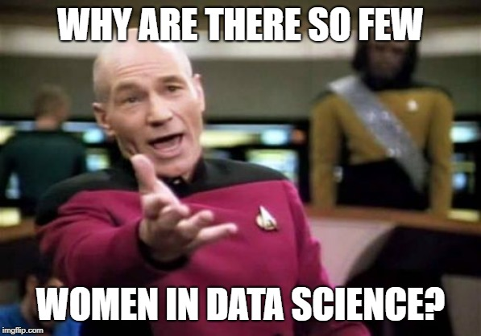
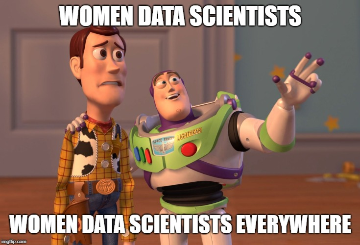
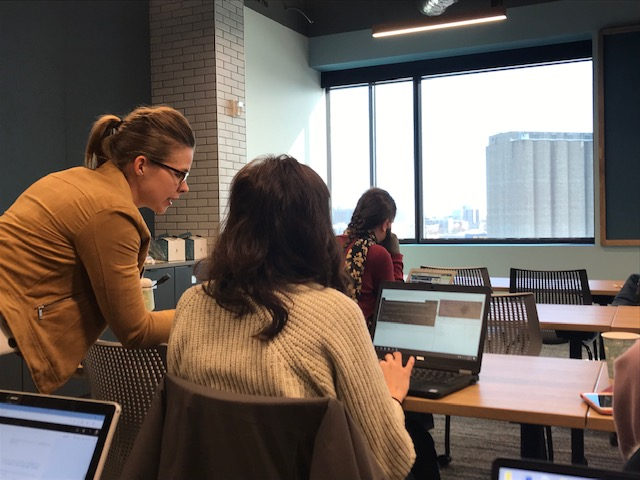
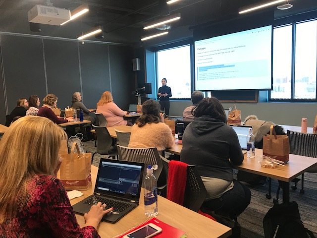

```{r setup, include=FALSE}
knitr::opts_chunk$set(echo = FALSE, message=FALSE, warning = FALSE, 
                      error = FALSE, comment=FALSE, hide = TRUE)
```

```{r include = FALSE}
# load the STEM career data
stem1993 <- Hmisc::sasxport.get("../ecg93.xpt")
stem1995 <- Hmisc::sasxport.get("../sestat95.xpt")
stem1997 <- Hmisc::sasxport.get("../sestat97.xpt")
stem1999 <- Hmisc::sasxport.get("../sestat99.xpt")
stem2003 <- Hmisc::sasxport.get("../ecg03.xpt")
stem2006 <- Hmisc::sasxport.get("../epses06.xpt")
stem2008 <- Hmisc::sasxport.get("../epse08.xpt")
stem2010 <- Hmisc::sasxport.get("../epcg10.xpt")
stem2013 <- Hmisc::sasxport.get("../epcg13.xpt")
stem2015 <- Hmisc::sasxport.get("../epcg15.xpt")
stem2017 <- Hmisc::sasxport.get("../epcg17.xpt")

```

```{r}
perc.f.1993 <- prop.table(table(stem1993$gender, stem1993$ocprmg, exclude = "8"), margin = 1)
perc.f.1995 <- prop.table(table(stem1995$gender, stem1995$ocprmg, exclude = "8"), margin = 1)
perc.f.1997 <- prop.table(table(stem1997$gender, stem1997$ocprmg, exclude = "8"), margin = 1)
perc.f.1999 <- prop.table(table(stem1999$gender, stem1999$ocprmg, exclude = "8"), margin = 1)
perc.f.2003 <- prop.table(table(stem2003$gender, stem2003$nocprmg, exclude = "8"), margin = 1)
perc.f.2006 <- prop.table(table(stem2006$gender, stem2006$nocprmg, exclude = "8"), margin = 1)
perc.f.2008 <- prop.table(table(stem2008$gender, stem2008$nocprmg, exclude = "8"), margin = 1)
perc.f.2010 <- prop.table(table(stem2010$gender, stem2010$n2ocprmg, exclude = "8"), margin = 1)
perc.f.2013 <- prop.table(table(stem2013$gender, stem2013$n2ocprmg, exclude = "8"), margin = 1)
perc.f.2015 <- prop.table(table(stem2015$gender, stem2015$n2ocprmg, exclude = "8"), margin = 1)
perc.f.2017 <- prop.table(table(stem2017$gender, stem2017$n2ocprmg, exclude = "8"), margin = 1)

perc.f.r.ds <- c(perc.f.1993[1],
                 perc.f.1995[1],
                 perc.f.1997[1],
                 perc.f.1999[1],
                 perc.f.2003[1],
                 perc.f.2006[1],
                 perc.f.2008[1],
                 perc.f.2010[1],
                 perc.f.2013[1],
                 perc.f.2015[1],
                 perc.f.2017[1],
                 perc.f.1993[2],
                 perc.f.1995[2],
                 perc.f.1997[2],
                 perc.f.1999[2],
                 perc.f.2003[2],
                 perc.f.2006[2],
                 perc.f.2008[2],
                 perc.f.2010[2],
                 perc.f.2013[2],
                 perc.f.2015[2],
                 perc.f.2017[2])
perc.fds.1993 <- prop.table(table(stem1993$gender, stem1993$ocprmg, exclude = "8"), margin = 2)
perc.fds.1995 <- prop.table(table(stem1995$gender, stem1995$ocprmg, exclude = "8"), margin = 2)
perc.fds.1997 <- prop.table(table(stem1997$gender, stem1997$ocprmg, exclude = "8"), margin = 2)
perc.fds.1999 <- prop.table(table(stem1999$gender, stem1999$ocprmg, exclude = "8"), margin = 2)
perc.fds.2003 <- prop.table(table(stem2003$gender, stem2003$nocprmg, exclude = "8"), margin = 2)
perc.fds.2006 <- prop.table(table(stem2006$gender, stem2006$nocprmg, exclude = "8"), margin = 2)
perc.fds.2008 <- prop.table(table(stem2008$gender, stem2008$nocprmg, exclude = "8"), margin = 2)
perc.fds.2010 <- prop.table(table(stem2010$gender, stem2010$n2ocprmg, exclude = "8"), margin = 2)
perc.fds.2013 <- prop.table(table(stem2013$gender, stem2013$n2ocprmg, exclude = "8"), margin = 2)
perc.fds.2015 <- prop.table(table(stem2015$gender, stem2015$n2ocprmg, exclude = "8"), margin = 2)
perc.fds.2017 <- prop.table(table(stem2017$gender, stem2017$n2ocprmg, exclude = "8"), margin = 2)

perc.ds.r.f <- c(perc.fds.1993[1],
                 perc.fds.1995[1],
                 perc.fds.1997[1],
                 perc.fds.1999[1],
                 perc.fds.2003[1],
                 perc.fds.2006[1],
                 perc.fds.2008[1],
                 perc.fds.2010[1],
                 perc.fds.2013[1],
                 perc.fds.2015[1],
                 perc.fds.2017[1],
                 perc.fds.1993[2],
                 perc.fds.1995[2],
                 perc.fds.1997[2],
                 perc.fds.1999[2],
                 perc.fds.2003[2],
                 perc.fds.2006[2],
                 perc.fds.2008[2],
                 perc.fds.2010[2],
                 perc.fds.2013[2],
                 perc.fds.2015[2],
                 perc.fds.2017[2])
Year <- as.factor(c(1993, 1995, 1997,1999,2003,2006,2008,2010,2013,2015,2017,
          1993, 1995, 1997,1999,2003,2006,2008,2010,2013,2015,2017))
Sex <- c("F","F","F","F","F","F","F","F","F","F","F",
         "M","M","M","M","M","M","M","M","M","M","M")

perc.comp.math <- data.frame(perc.f.r.ds, perc.ds.r.f, Year, Sex)


```

```{r}
# Write a function to recode
library(plyr)
rec.satis <- function(x){
  return(revalue(x,
          c("1" = "Very satisfied",
            "2" = "Somewhat satisfied",
            "3" = "Somewhat dissatisfied",
            "4" = "Very dissatisfied",
            "L" = NA)))
}

stem2017$job.cat <- revalue(stem2017$n2ocprmg, 
                        c("1" = "Computer and math scientist",
                          "2" = "Other Scientist (bio, phys)", 
                          "3" = "Other Scientist (bio, phys)",
                          "4" = "Social Scientist",
                          "5" = "Engineer",
                          "6" = "Other Scientist (bio, phys)",
                          "7" = "Not Scientist",
                          "8" = NA))

# recode and rename
stem2017$satis.advance <- rec.satis(stem2017$satadv)
stem2017$satis.salary <- rec.satis(stem2017$satsal)
stem2017$satis.contrib <- rec.satis(stem2017$satsoc)

```
## Disclaimer

Data science is an emerging field, so research on "data science" per se is limited. The evidence in this presentation focuses mostly on the fields of computer science and math/statistics since they are (arguably) the foundational fields in data science. They are also the STEM fields (along with engineering) that have persistent gender disparities: 
    
```{r}
library(ggplot2)
ggplot(data = subset(stem2017, !is.na(job.cat)), 
       aes(x = gender, fill = job.cat)) +
  geom_bar(aes(y = ..prop.., group = 1)) +
  theme_minimal() + ylab("Percent within job category") + xlab("Sex") +
   facet_wrap(~job.cat) + 
  scale_fill_manual(values = c("#88398a","gray60","gray60","dodgerblue2","gray60")) +
  scale_y_continuous(labels = scales::percent)+theme(legend.position="none") +
  ggtitle("College graduate field of employment (NSF, 2017).")

```
    
## Percent of male and female college grads who are data scientists 
<br><BR>
<center>
```{r}
library(ggplot2)
ggplot(data = perc.comp.math, 
       aes(y = 100*perc.f.r.ds, x = Year, group = Sex)) +
  geom_line(aes(color = Sex), size = 1) + 
  geom_point(aes(color = Sex), size = 2) +
  theme_minimal() + ylab("Percent") +
  ylim(0,20) + theme(text = element_text(size=16)) +
  scale_color_manual(values = c("#88398a","dodgerblue2")) +
  guides(color = guide_legend(reverse = T)) 
```


## Percent of data scientists who are male and female
<br><br>
<center>
```{r}
ggplot(data = perc.comp.math, 
       aes(y = 100*perc.ds.r.f, x = Year, group = Sex)) +
  geom_line(aes(color = Sex), size = 1) + 
  geom_point(aes(color = Sex), size = 2) +
  theme_minimal() + ylab("Percent") + 
  ylim(0,100)+ theme(text = element_text(size=16)) +
  scale_color_manual(values = c("#88398a","dodgerblue2")) +
  guides(color = guide_legend(reverse = T)) 

```


## WTF? 
Actual picture of me after making those graphs

## WTF? 
Actual picture of me after making those graphs

<br><br>
<center>
{align="center"}

## Women data scientists are satisfied with salary
<br><BR>
<center>
```{r}
stem2017.noNAsal <- subset(stem2017, gender == "F" & !is.na(satis.salary))

ggplot(data = subset(stem2017.noNAsal, !is.na(job.cat)), 
       aes(x = job.cat, fill = reorder(satis.salary, desc(satis.salary)))) +
  geom_bar(position = "fill") + 
  theme_minimal() + xlab("Job type") + 
  scale_fill_brewer(name = "", guide = guide_legend(reverse=TRUE,nrow=2,byrow=TRUE), 
                    palette = "Purples") + theme(text = element_text(size=12),
                                            legend.position = "bottom") +
  coord_flip() +
  ylab("Percent") + scale_y_continuous(labels = scales::percent)
```


## Women data scientists are satisfied with opportunities for advancement  
<br><BR>
<center>
```{r}
stem2017.noNAadv <- subset(stem2017, gender == "F" & !is.na(satis.advance))

ggplot(data = subset(stem2017.noNAsal, !is.na(job.cat)), 
       aes(x = job.cat, fill = reorder(satis.advance, desc(satis.advance)))) +
  geom_bar(position = "fill") + 
  theme_minimal() + xlab("Job type") + 
  scale_fill_brewer(name = "", guide = guide_legend(reverse=TRUE,nrow=2,byrow=TRUE), 
                    palette = "Purples") + theme(text = element_text(size=12),
                                            legend.position = "bottom") +
  coord_flip() +
  ylab("Percent") + scale_y_continuous(labels = scales::percent)
```

## Seriously then... 
<br><BR>
<center>


## Explanations in the scientific literature 

- biological: natural ability in the field 
- social-cultural: societal and cultural norms (e.g., stereotypes) 
- structural: institutional barriers 

## Biological: Males are innately better at math & computers (largely debunked)
<br><Br>
<center>
{ width=750 }

## Actual picture of me after reading this  

<br><br>
<center>


## Social-cultural: Kids perceive "computer people" as male and nerds
<BR><BR>
<center>


## Social-cultural: Male students have more confidence with computers & math 

<BR><BR>
<center>


## Social-cultural: Stereotype threat reduces math scores for female students

<br><Br>
<center>
{ width=750 }


## Social-cultural: My colleague identifies role models in statistics 
<br><br>
<center>
{ width=750 }

## Social-cultural: Women lack confidence in ability to do math

<center>
{ width=750 }
<br><br>

## Structural: Elementary teachers believe boys are better than girls at math 
<br><BR>
<center>
{ width=450 }

## Structural: Companies hire males over females given same qualifications

<br><BR>
<center>
{ width=750 }

## Structural: Women in STEM are more affected by the "family penalty" in the workplace 

<br><br>
<center>


## ....and then there were few women in data science
<br><br>
<center>


## Lame. How do we get out of this mess?
<BR><BR>
<center>


## We can be visible 
<br>
<center>
{ width=425 }&nbsp;&nbsp;&nbsp;&nbsp;
{ width=425 }

## We can be and seek role models
<br><br>
<center>
{ width=425 }&nbsp;&nbsp;&nbsp;&nbsp;
{ width=425 }

## We can teach about stereotype threat and use counter-stereotypes
<br><br>
<center>


## We can share successful strategies 
<br><br>
<center>
{ width=400 }

## Basically, we can create a visible community of and for women in data science
<br><br>
<center>
{ width=600 }

## Nobody can do everything, but everyone can do something 

- Evidence-based things you can do: 

    + Be visible (or assist others in being visible)
    + Teach about stereotype threat 
    + Use counter-stereotypes 
    + Be a role model 

<center>
{ width=400 }

## And we don't have to do it alone 

- Local groups specifically focused on / supporting gender diversity in data science:

    + R-Ladies St. Louis 
    + Women in Data Science St. Louis 
    + St. Louis Women in Tech Exchange 

- Ally groups: 

    + St. Louis R Users  
    + St. Louis Machine Learning & Data Science 

<center>
{ width=400 }

## Thank you!
<BR><BR>
<center>


